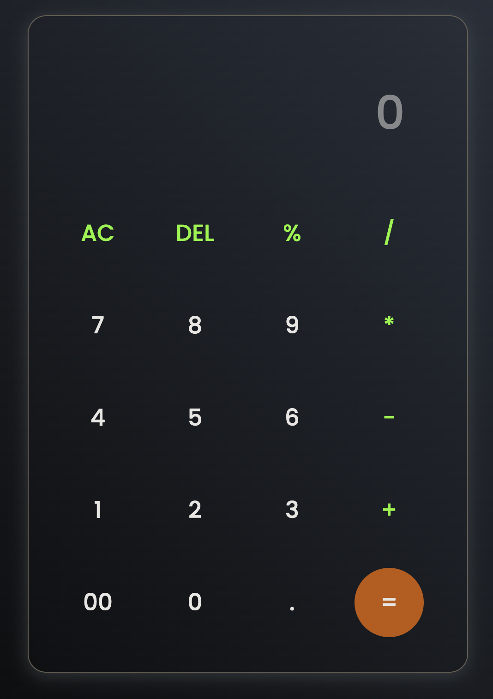

# Simple Calculator 

## Description 
A simple calculator to complete basic arithmetic functions.

## Table of Contents

* [Installation](#installation)
* [Usage](#usage)
* [Credits](#credits)
* [License](#license)
* [Features](#features)
* [Contributing](#contributing)
* [Tests](#tests)
* [Questions](#questions)

## Screenshot

## Installation 
N/A

## Usage 
Clone repository to local machine and open index.html with live server.

## Credits 
Code Traversal

## License
This application is covered under the [MIT](https://opensource.org/licenses/MIT) license.

## Features 
N/A

## Contributing 
N/A

## Tests 
N/A

## Questions 
* You can find me on GitHub at [pbodybrooks](https://github.com/pbodybrooks). 
* Please do not hesitate to reach out to me via my email: parkerlamarbrook@gmail.com.
